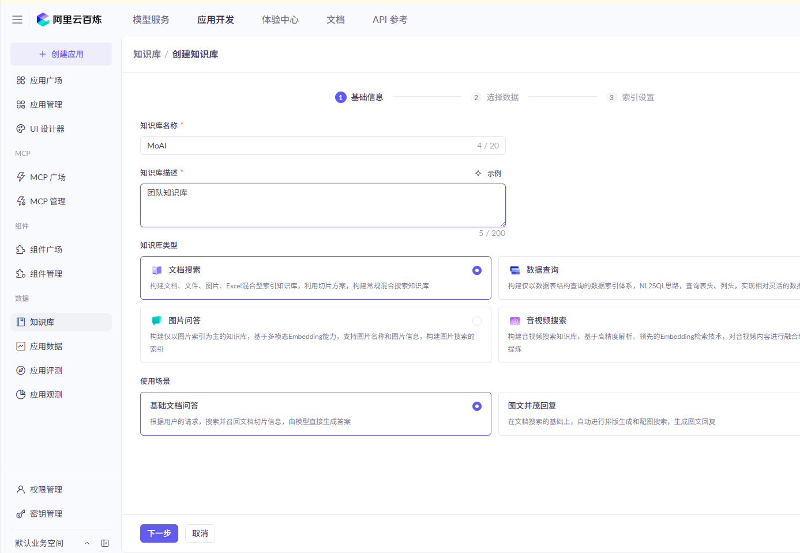
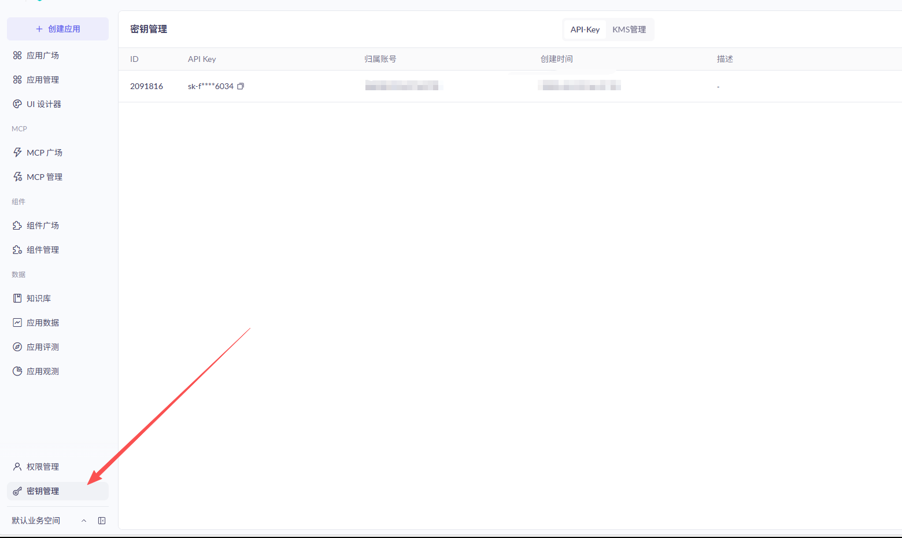
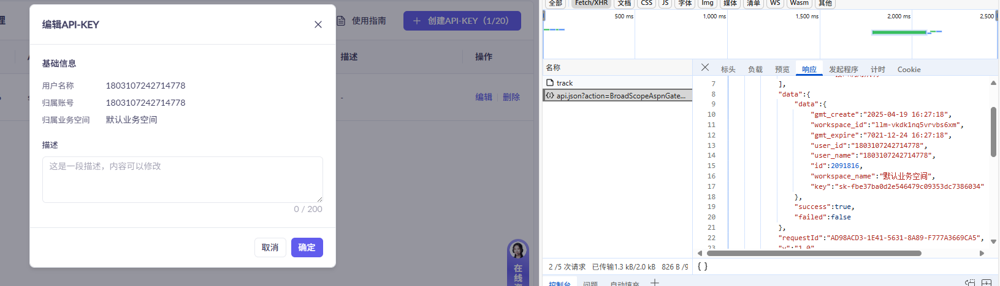
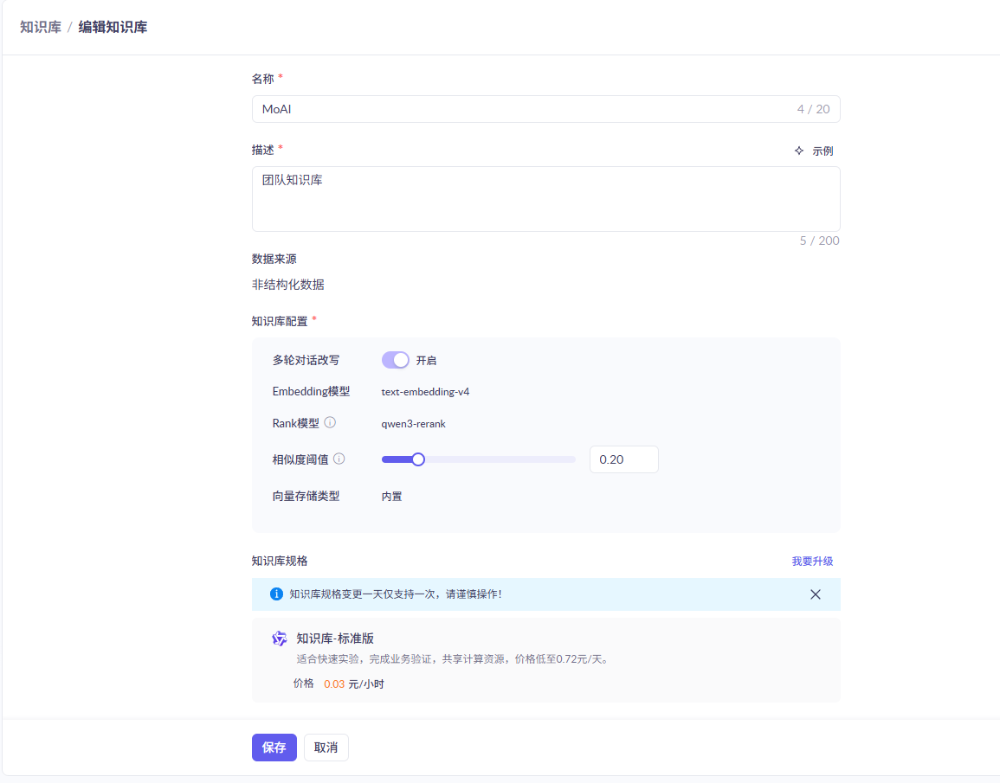

# 百炼知识库

大模型缺乏私有知识，且通用知识更新滞后。业界通常采用检索增强生成（RAG）技术，根据用户输入从外部信息源检索相关信息，然后将检索到的内容整合到用户输入中，从而帮助大模型生成更准确的回答。知识库功能作为阿里云百炼的RAG能力，能有效补充私有知识并提供最新信息。

创建知识库

从百炼平台创建 key。

[https://help.aliyun.com/zh/model-studio/get-api-key?spm=api-workbench.api_explorer.0.0.4fec7b33sLUCNX](https://help.aliyun.com/zh/model-studio/get-api-key?spm=api-workbench.api_explorer.0.0.4fec7b33sLUCNX)

- Base URL：[大模型服务平台百炼_云产品主页-阿里云OpenAPI开发者门户](https://api.aliyun.com/product/bailian)

你可以从这里了解这些参数的作用 [https://api.aliyun.com/api/bailian/2023-12-29/Retrieve?spm=a2c4g.11186623.0.0.4f5c4fd2sIqz5V&RegionId=cn-beijing](https://api.aliyun.com/api/bailian/2023-12-29/Retrieve?spm=a2c4g.11186623.0.0.4f5c4fd2sIqz5V&RegionId=cn-beijing)

插件不支持配置重排，如果需要设置重排模型和设定，请到百炼后台设置。

