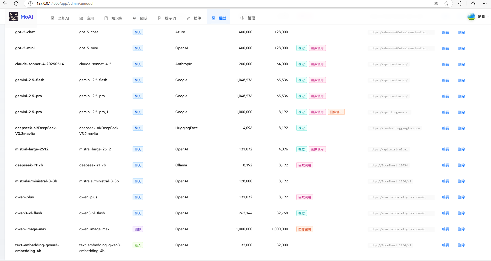
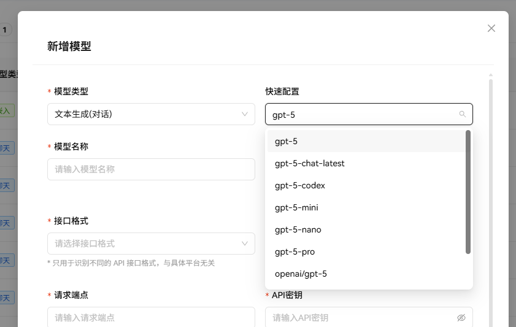
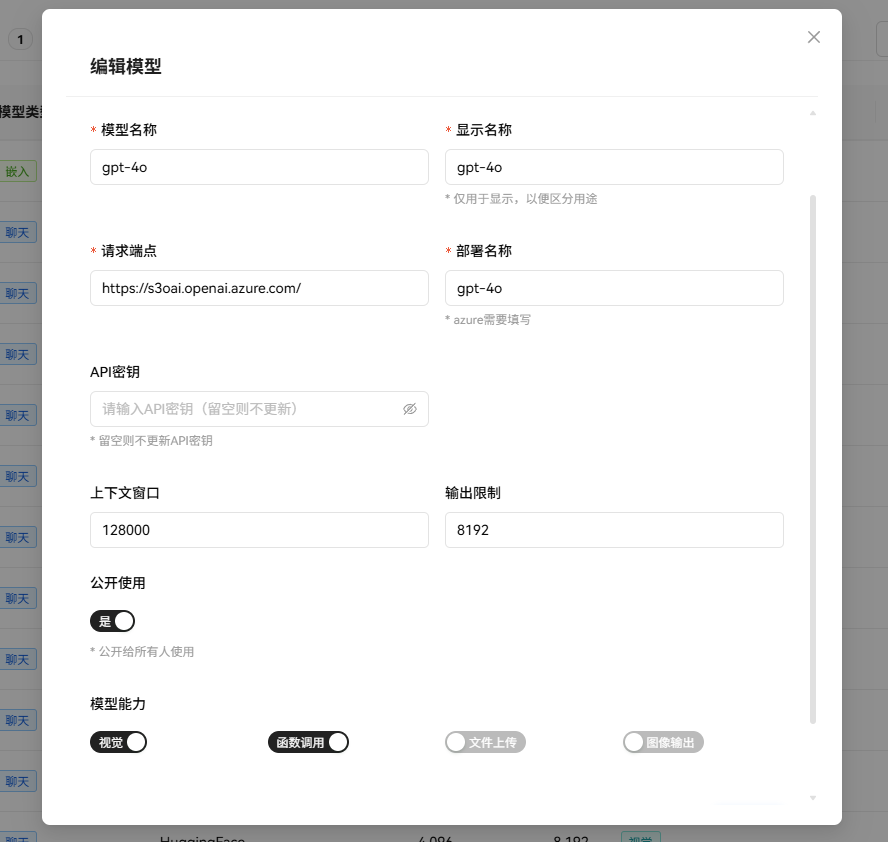

# 管理模型

MoAI 支持多种模型，支持 OpenAI、Azure OpenAI、Google、Mistral 等格式的接口，无论是本地的 Ollama、LM Studio 还是第三方平台如百炼、OpenRouter 都可以接入。

目前主要是开发了对话模型、向量化模型、视觉模型的效果应用，对应音频、图形生成等模型还没有开始支持。

添加模型时，在快速配置列表可以找到对应的模型，点击后自动配置上下文参数等。

显示名称：用户使用模型时看到的名称

请求端点：不需要填 `/v1`

模型名称：模型的名称，不要填错，例如 `DeepSeek-V3.2` 模型的名称其实是 `deepseek-chat`。

部署名称：Azure 要填，其它的接入商填跟模型名称一样的就行。

是否公开：如果公开，则每个用户都可以自由使用该模型。如果不公开，则可以自由配置授权给哪些团队使用。

