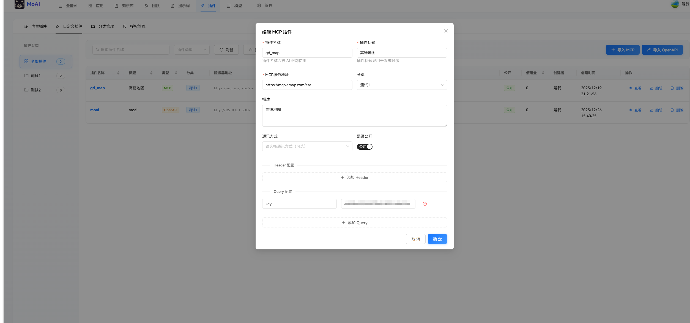
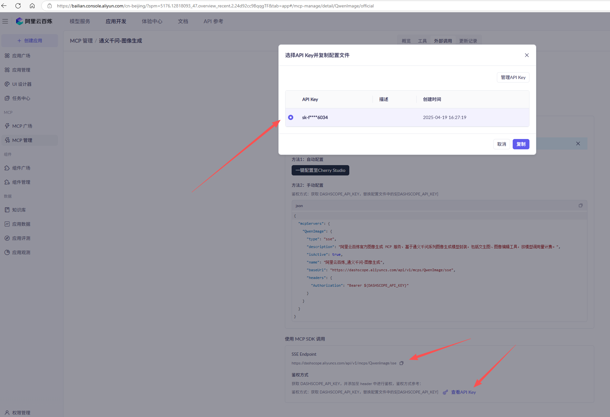
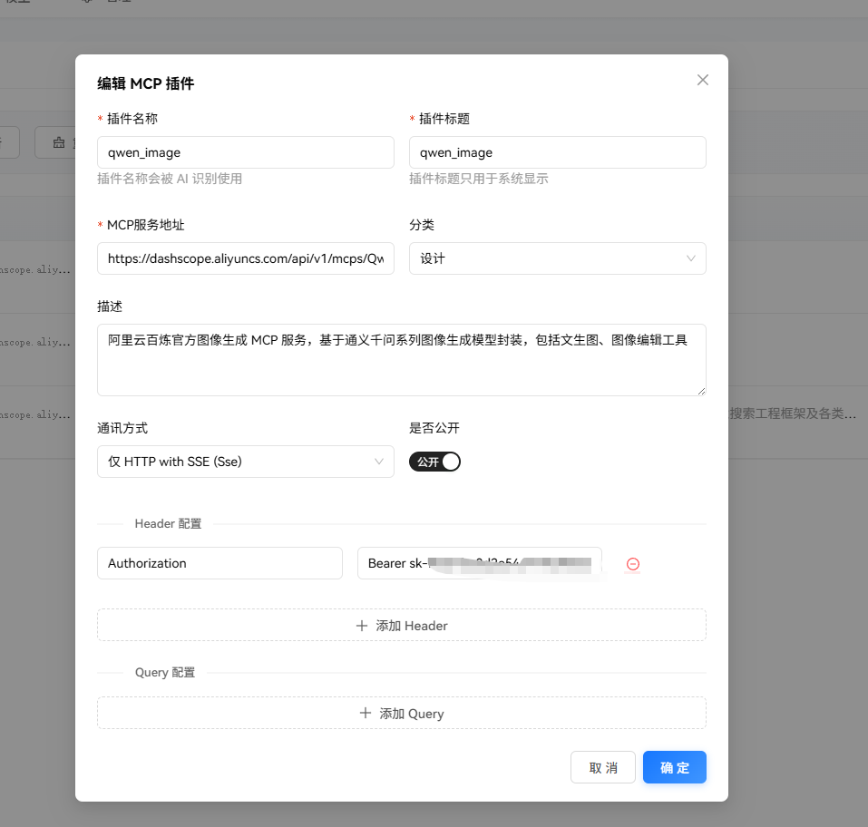
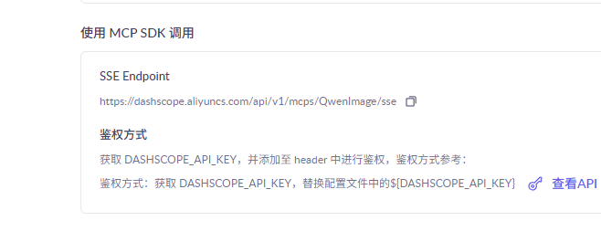
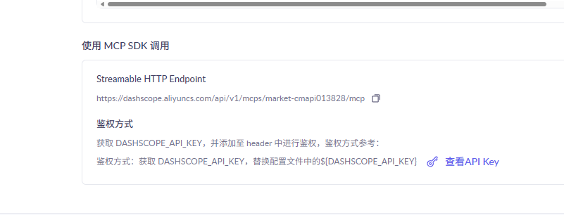
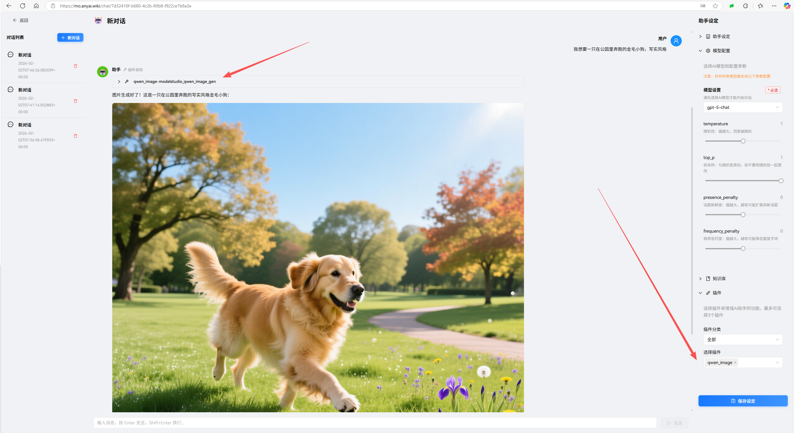

# MCP 插件

MCP 插件配置比较简单。

你可以在这里通过 MCP 接入各大平台的服务，以阿里云百炼平台的通义千问-图像生成为例，开通服务后，复制 `baseUrl` 和 Key。

填写时要注意其通讯方式，百炼平台有些 MCP 服务是 sse，有些是 streamable 格式。

接入 MCP 服务后，你可以在 AI 对话或应用开发中，使用该插件。

你可以在团队中创建应用，并在应用里面添加该插件，那么这个应用就具有对应的能力。

