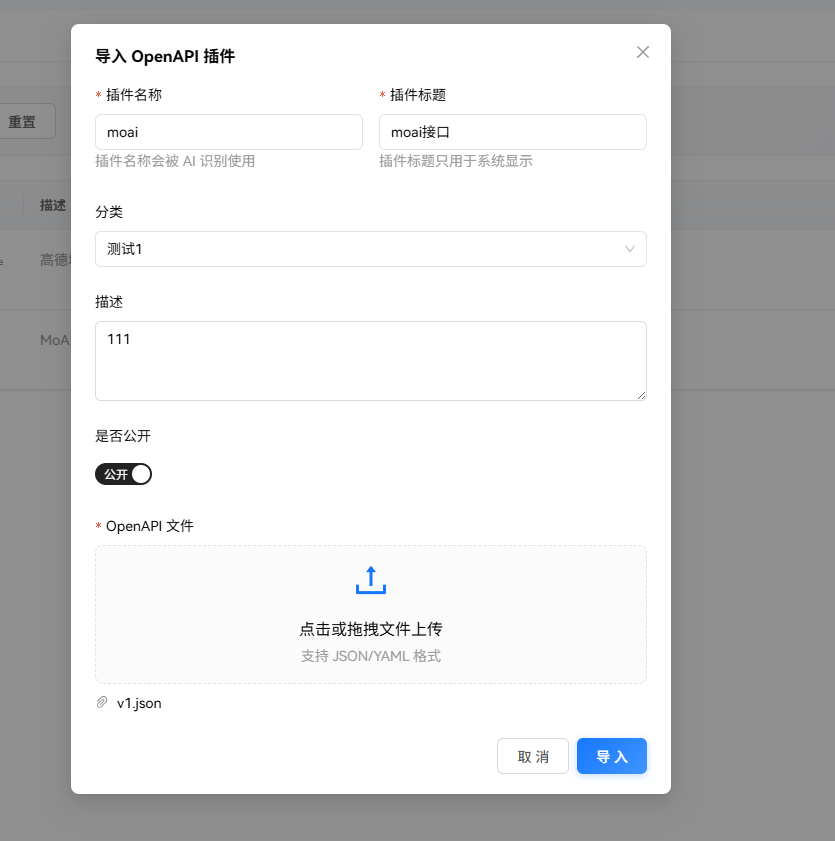
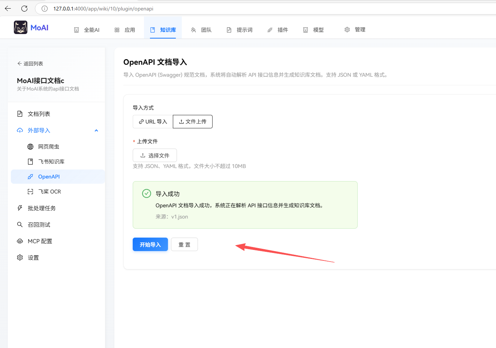
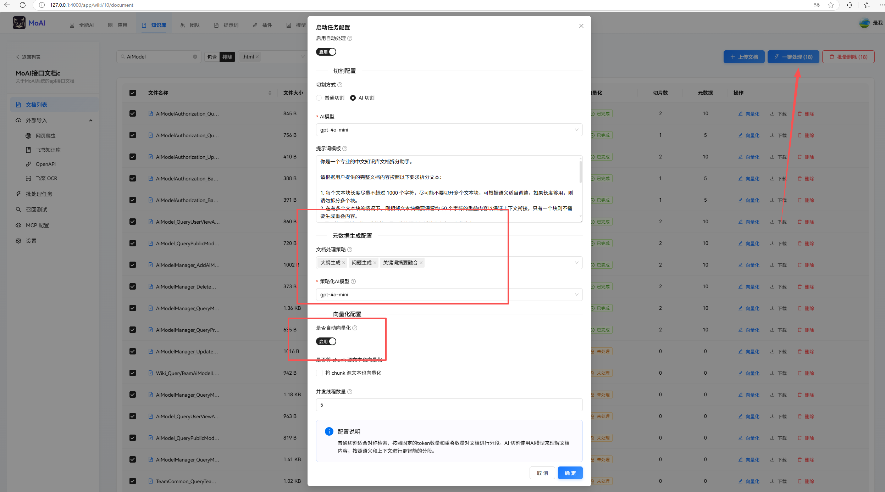
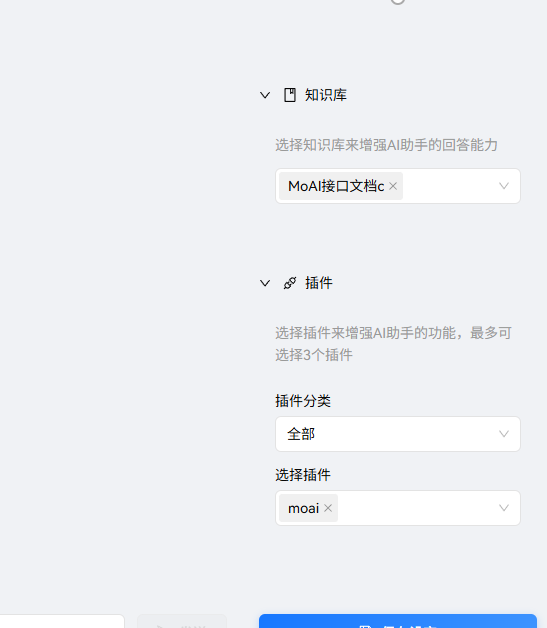
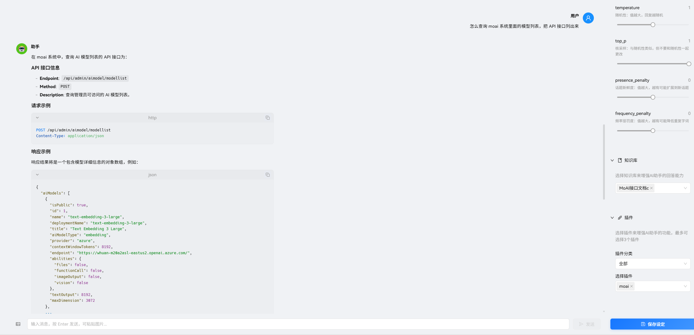
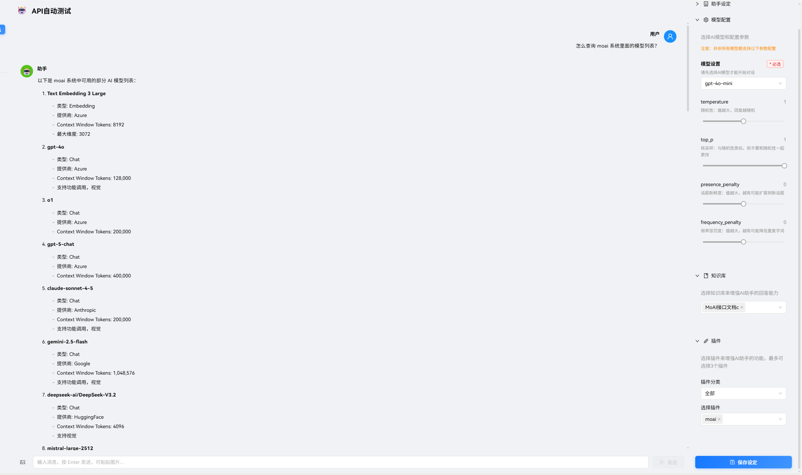
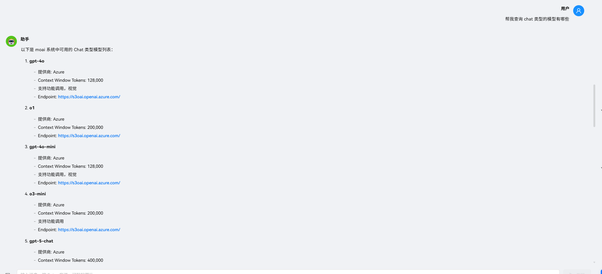

# OpenAPI

OpenAPI 是接口的文档，程序员应该都知道，公司很多服务要支持 MCP 没那么简单，有很多技术债务，所以可以通过 OpenAPI 的方式接入到 MoAI，MoAI 可以转化为对应的能力提供给 AI。

支持 json、yaml 格式。

有个很骚的玩法。

在自定义插件里面，把业务系统的 api 接口导入生成插件后，你可以到知识库也导入，以便生成相关的知识。

导入后，知识库会按照每个接口生成一份文档。

你可以将生成的文档向量化到知识库里面，

在 AI 应用里面选择这个业务系统的知识库和插件。

因为接口文档已被转换到知识库里面，所以跟 AI 进行对话时，会自动基于知识库索引知识和回答问题。

更加骚的来了，因为把业务系统的接口转换成插件了，所以在对话中，一句话就可以让 AI 帮你请求接口返回数据，AI 会帮你自动整理请求参数。

