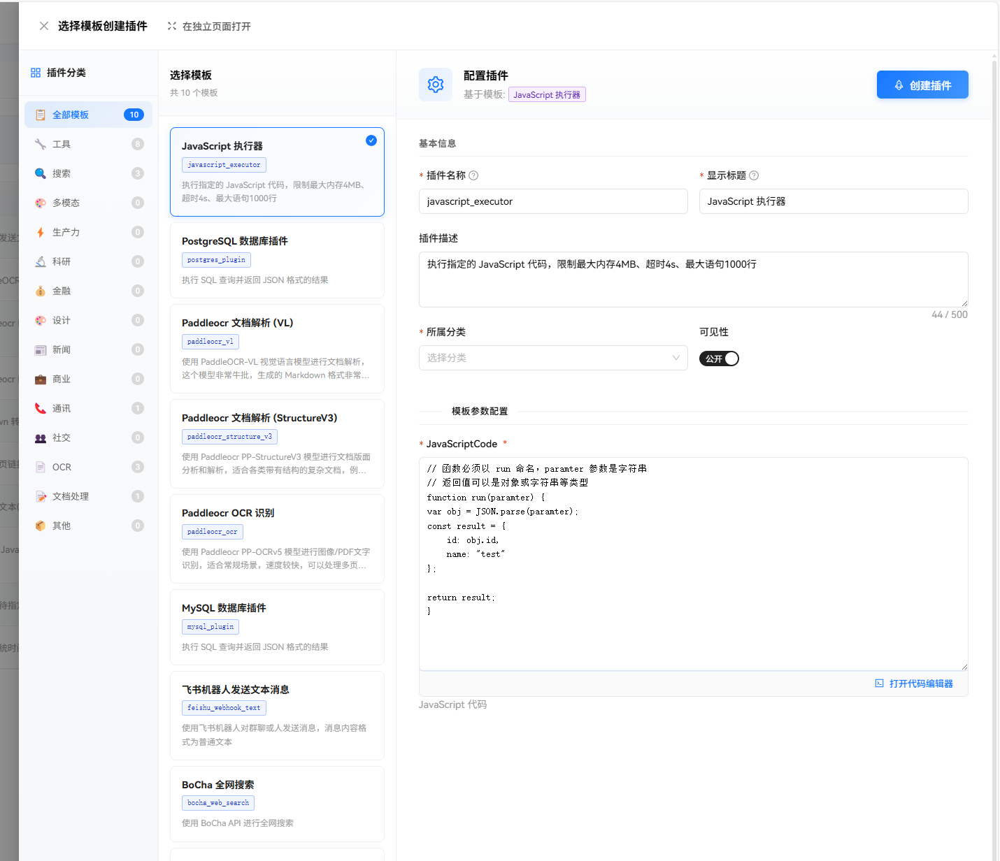
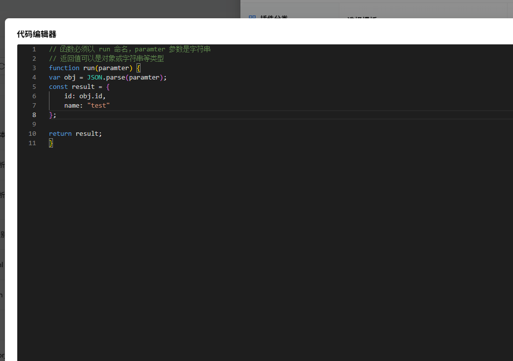
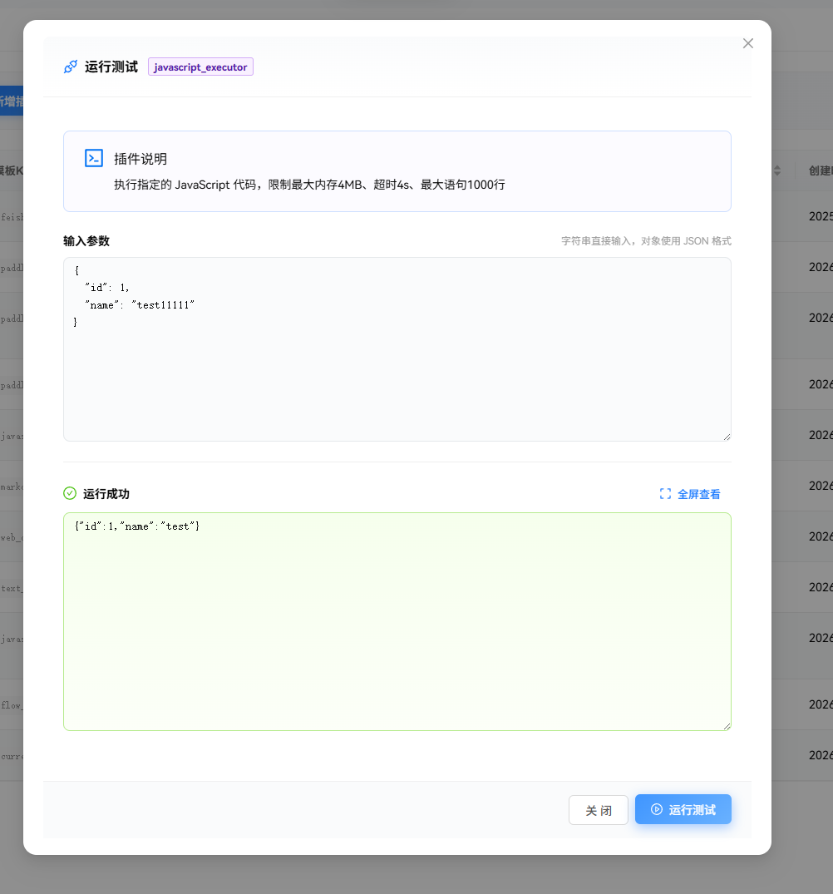

# javascript 插件

该插件支持执行 javascript 代码，在流程编排中使用广泛。

javascript 插件有两种使用显示，一种是提前编写代码在运行时传递参数，另一种是运行时传递代码直接运行。


在模板中选择 JavaScript ，然后配置代码。






代码示例如下。

paramter 是参数，运行时会压缩为 json 字符串，因此需要反序列化为对象。

支持返回执行结果，在 AI 对话和流程编排中，返回的结果以 json 对象显示。

```javascript
// 函数必须以 run 命名，paramter 参数是字符串
// 返回值可以是对象或字符串等类型
function run(paramter) {
var obj = JSON.parse(paramter);
const result = {
    id: obj.id,
    name: "test"
};

return result;
}
```


运行时，参数是 json 或 js 对象。



