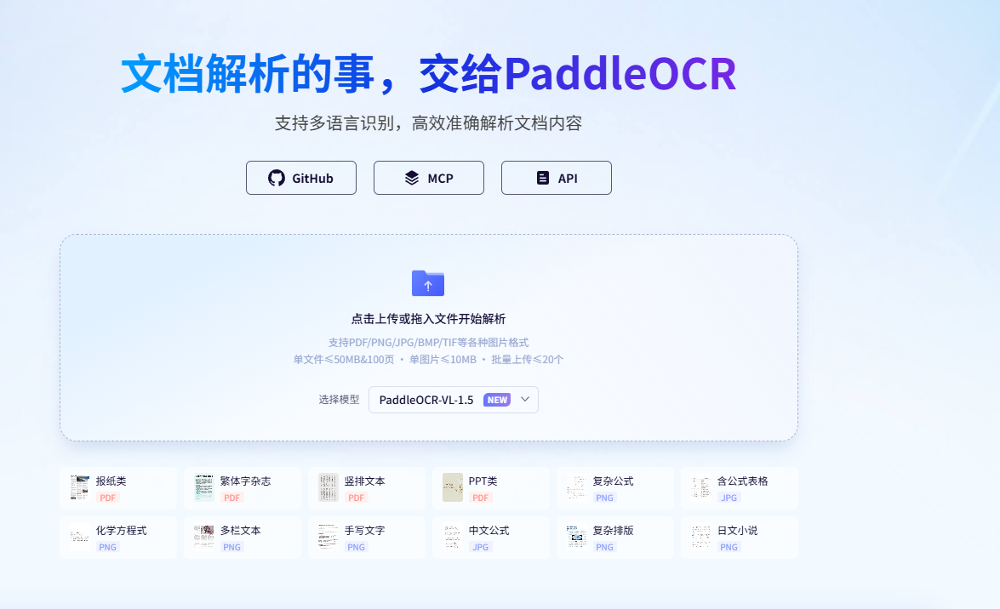
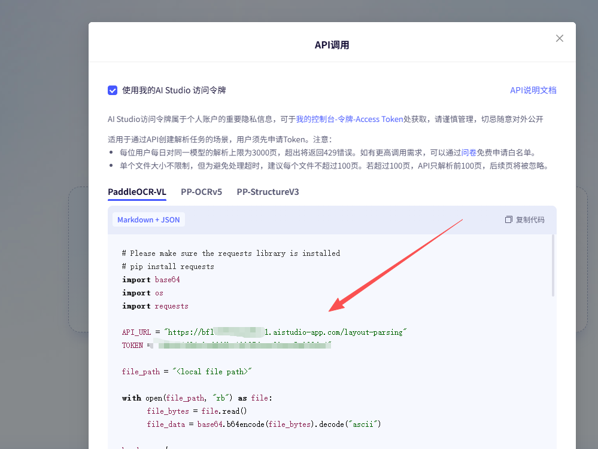
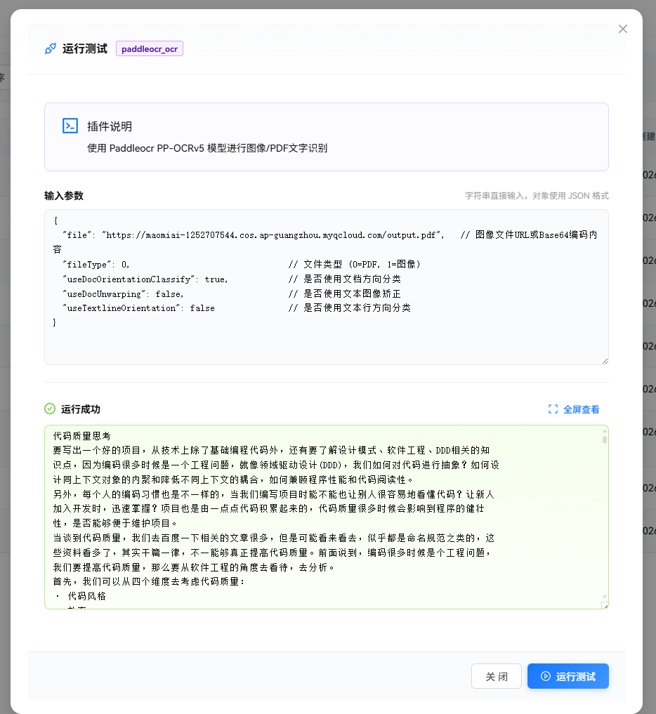
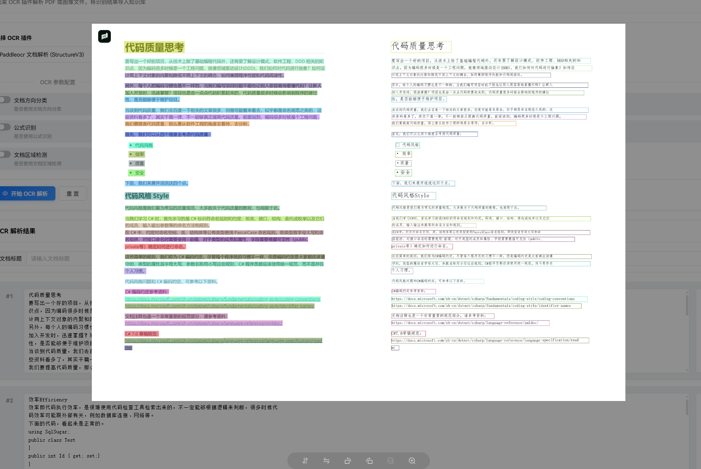

# 百度飞桨

**PaddleOCR** 将文档和图像转换为**结构化、AI友好的数据**（如JSON和Markdown），**精度达到行业领先水平**——为全球从独立开发者，初创企业和大型企业的AI应用提供强力支撑。凭借**60,000+星标**和**MinerU、RAGFlow、pathway、cherry-studio**等头部项目的深度集成，PaddleOCR已成为**AI时代**开发者构建智能文档等应用的**首选解决方案**。

本文介绍如何接入百度飞桨。

打开官网 https://aistudio.baidu.com/paddleocr，找到 API 调用，将里面的 API_URL 和 TOKEN 拿出来，注意，三个模型的地址和 TOKEN 都不一样。

在插件中配置。

可以在插件系统中直接运行该插件，参数说明参考 https://ai.baidu.com/ai-doc/AISTUDIO/Kmfl2ycs0

也可以在知识库中使用该插件，帮助将 pdf 文档提取出来，保存到知识库中。

你可以在识别结果中看到标识信息，一般判断识别效果是否有效。

