# 系统初始化

本文档介绍 MoAI 系统首次部署后的初始化流程和配置说明。


## 系统加密

服务首次启动时，会自动在 `configs` 目录下生成 RSA 密钥文件 `rsa_private.key`。

该密钥用于：
- JWT Token 签名和验证
- 用户密码传输加密
- 敏感数据加密

重要提示
- RSA 密钥文件一旦生成，请妥善保管，不要删除或修改
- 如果密钥丢失，所有已加密的数据将无法解密
- 生产环境部署时，建议备份 `configs/rsa_private.key` 文件
:::

前端在登录、注册、修改密码时，会先调用 `/api/common/publickey` 接口获取 RSA 公钥，然后使用公钥加密密码后再传输。


## 管理员账户

服务首次启动并完成数据库初始化后，MoAI 会自动创建一个默认管理员账户：

| 项目 | 值 |
|------|-----|
| 用户名 | `admin` |
| 密码 | `abcd123456` |

:::danger 安全警告
请在首次登录后立即修改管理员密码！
:::


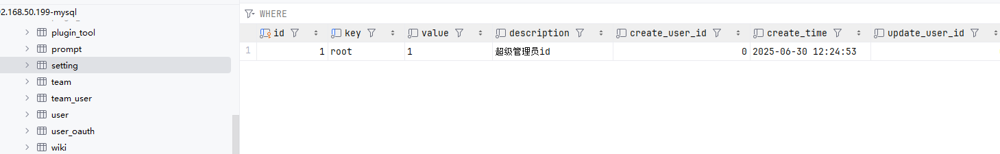


注意，每个用户的 salt 都是不一样的，也就是即使是相同的密码，存储到数据库生成的结果不一样，没法还原真正的密码。

如果密码丢失，可以将以下数据替换到数据库，恢复默认密码 `abcd123456`。

```
password:
I1GEpBEybOAb7lzpSTIBjNwhXkuT6kIywQK7LT7dsK0=

salt:
sWTmqzHfpUTD6THYzQNLPatQrpaIz+AzlU0+dc3JvsY=
```


## OAuth2.0 登录

MoAI 支持多种第三方 OAuth2.0 登录方式：

- 飞书（Feishu）
- 钉钉（DingTalk）
- 企业微信（WeixinWork）

配置第三方登录需要在对应平台创建应用并获取 AppId 和 AppSecret，然后在系统设置中配置。

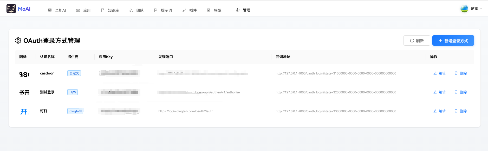

### 绑定第三方账户

点击头像-第三方账户，可以管理绑定的第三方账户。

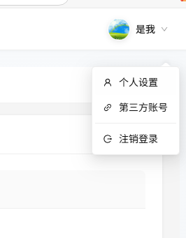


选择需要绑定的第三方账户，在弹出的窗口中授权，授权完成后等待数秒后自动关闭窗口。


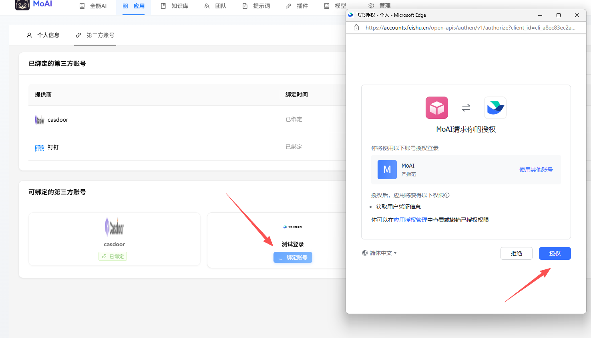

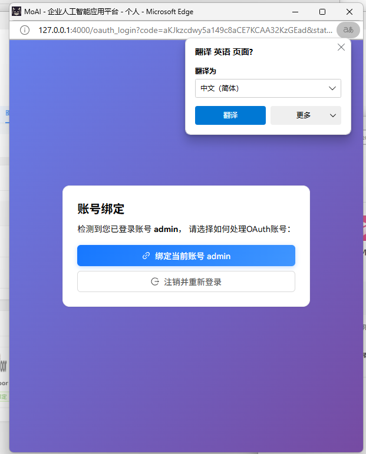


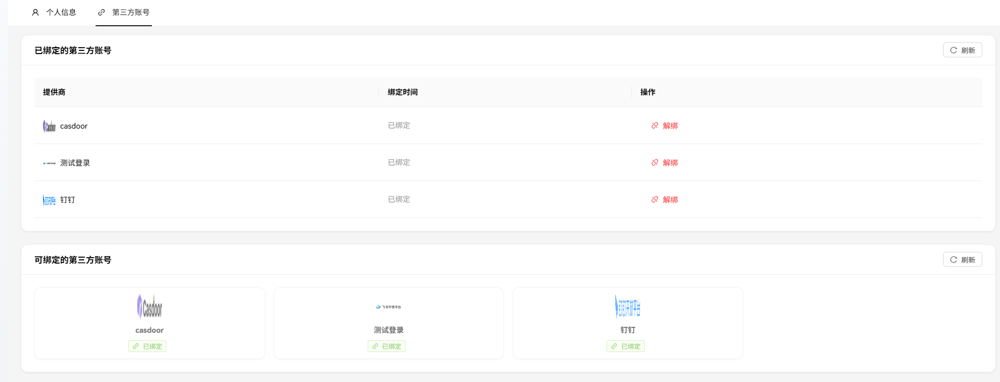


### 接入飞书

新建登录飞书，把飞书密钥填进去。

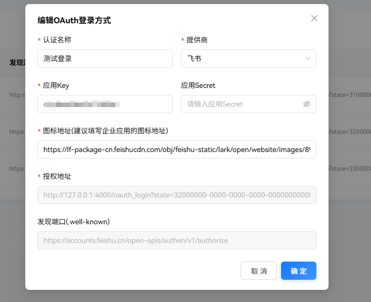


在页面找到回调地址，例如 `http://127.0.0.1:4000/oauth_login` ，回调地址后面的 state 可以不带。

将回调地址填写到飞书开放平台的安全设置中。

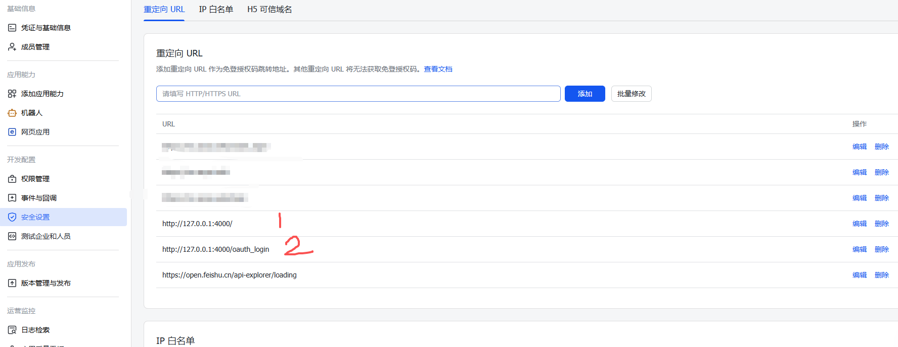


登录时可以选择飞书登录。

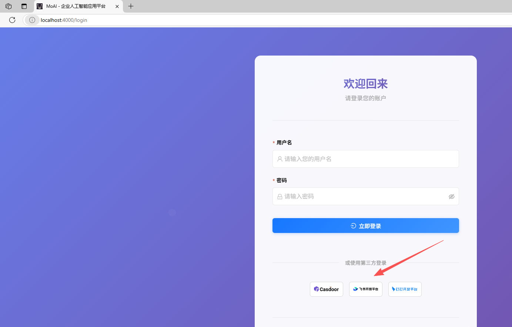

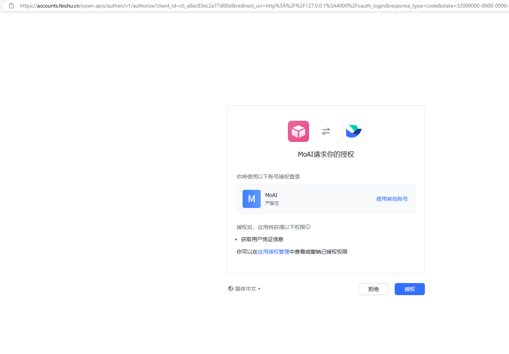

### 钉钉接入

打开钉钉开发者后台，找到需要配置的应用。

[https://open-dev.dingtalk.com/fe/app?hash=%23%2Fcorp%2Fapp#/corp/app](https://open-dev.dingtalk.com/fe/app?hash=%23%2Fcorp%2Fapp#/corp/app)


申请 `Contact.User.mobile`和`Contact.User.Read`权限

在安全设置里面配置重定向地址。

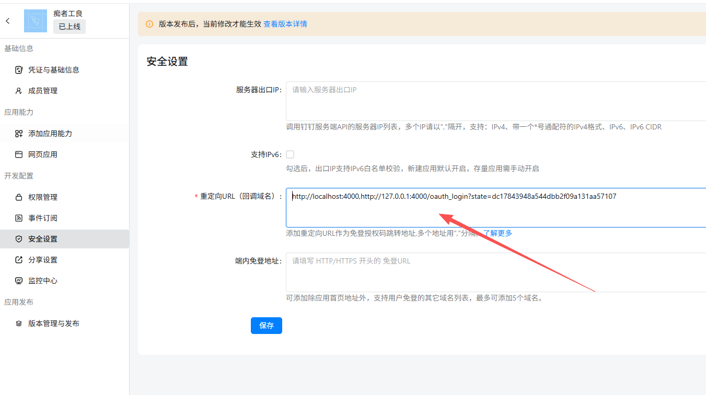


### OpenConnectID

Oauth2.0 接入也比较简单，以 Casdoor 为例。

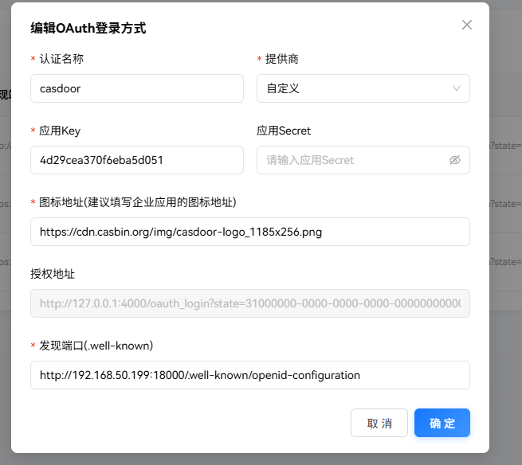


`.well-known` 是必填的，只有通过 `.well-known` 地址才能识别并接入对方的账户系统。

一般地址是 `/.well-known/openid-configuration`。

在 Casdoor 里面配置对应的回调地址。

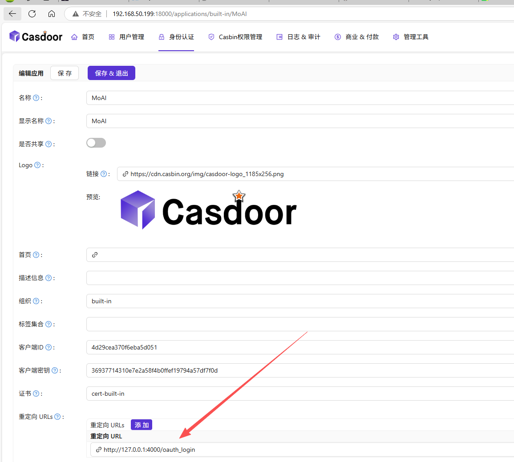


## 用户管理

管理员可以在后台管理界面进行用户管理：

- 查看所有用户列表
- 创建新用户
- 重置用户密码
- 禁用/启用用户账户
- 设置用户角色和权限

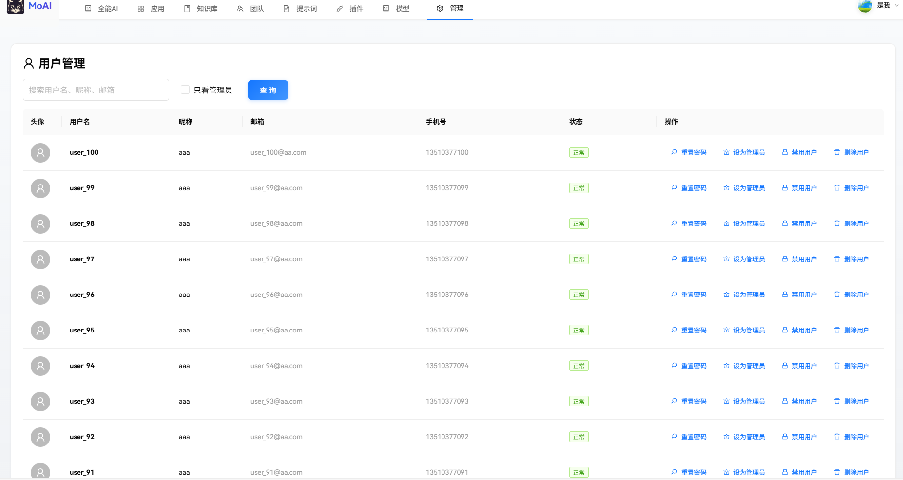


## 配置说明

以下配置使用 yaml 格式说明，你可以转换为 json。

### 向量数据库配置

知识库功能需要配置向量数据库，用于存储文档向量化后的数据：

```yaml
MoAI:
  Wiki:
    DBType: Postgres
    Database: 'Database=moai;Host=127.0.0.1;Password=123456;Port=5432;Username=postgres;Search Path=public'
```


推荐使用 PostgreSQL + pgvector 扩展作为向量数据库，MoAI 里面的 Docker Compose 默认配置已包含 pgvector 初始化脚本。


### 文件存储配置

MoAI 支持本地存储和 S3 兼容的对象存储：

**本地存储：**

```yaml
MoAI:
  Storage:
    Type: local
    LocalPath: '/data/moai/files'
```


**S3/MinIO/云存储：**

```yaml
MoAI:
  Storage:
    Type: S3
    Endpoint: 'https://s3.amazonaws.com'
    ForcePathStyle: false
    Bucket: 'your-bucket-name'
    AccessKeyId: 'your-access-key'
    AccessKeySecret: 'your-secret-key'
```


### 可观测性配置（可选）

支持 OpenTelemetry 协议，可将 Trace 和 Metrics 发送到 Jaeger、Grafana 等：

```yaml
MoAI:
  OTLP:
    Trace: 'http://127.0.0.1:4317/v1/traces'
    Metrics: 'http://127.0.0.1:4317/v1/metrics'
    Protocol: 0  # 0=gRPC, 1=HTTP
```


