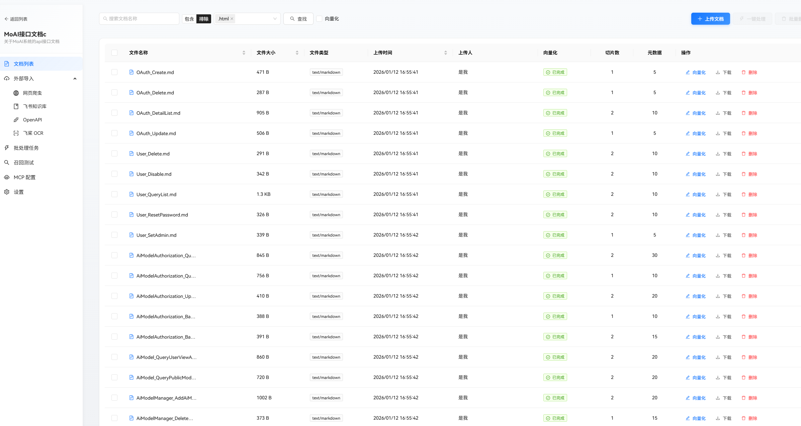
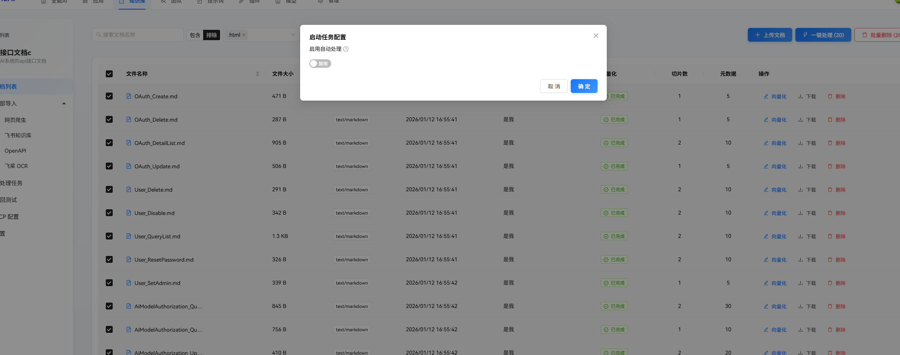
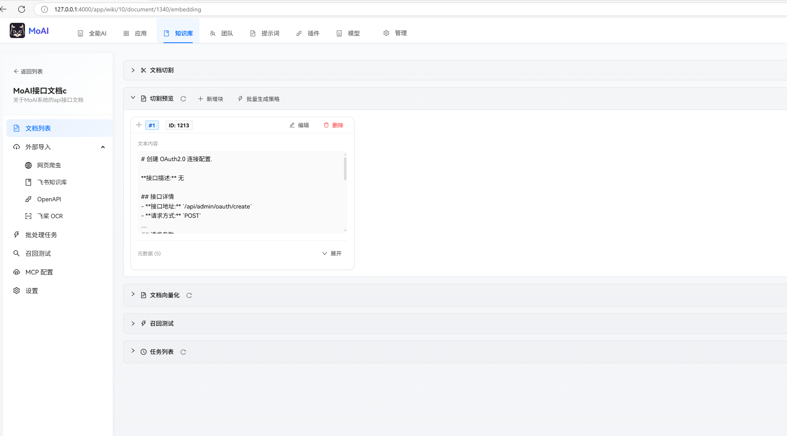
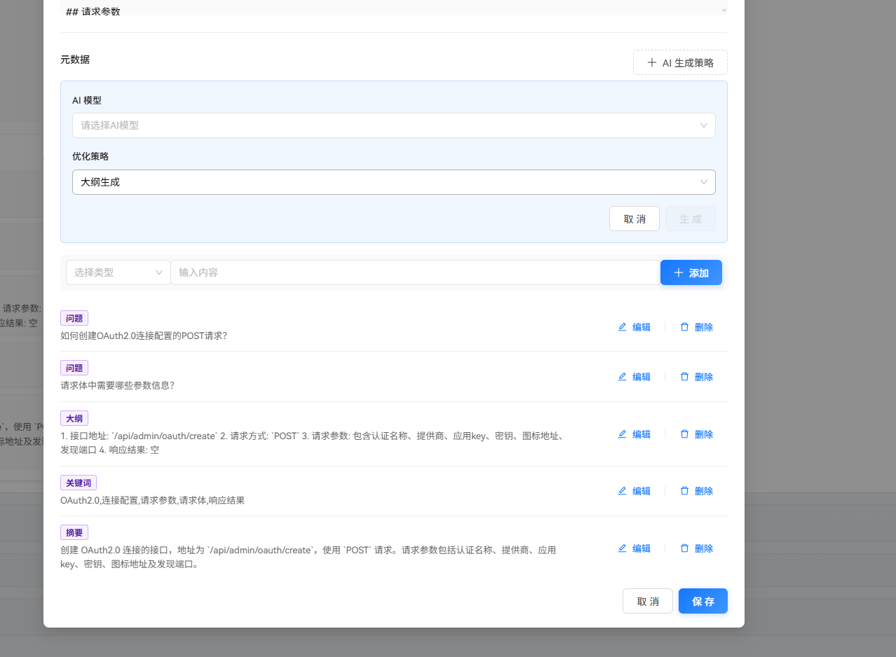
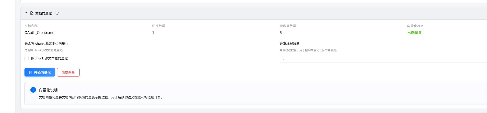
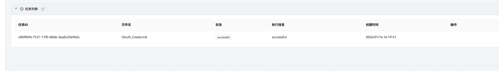
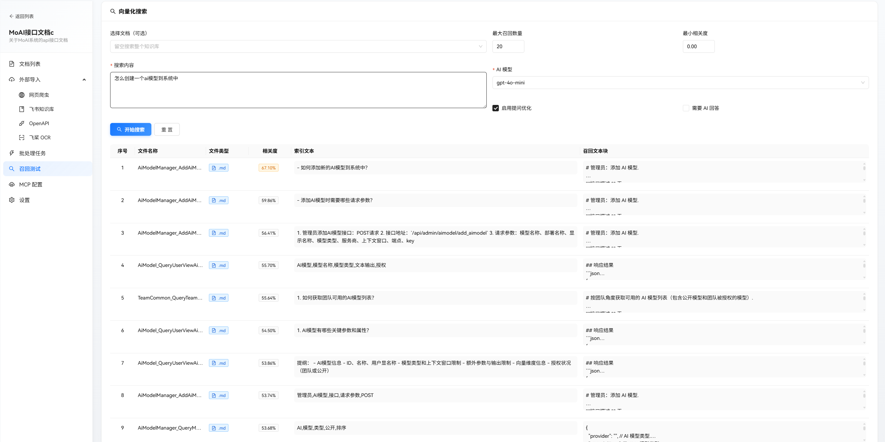
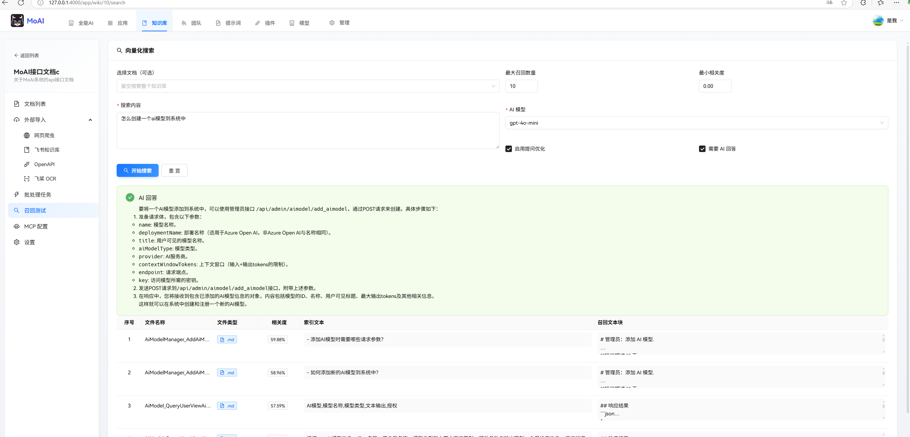

# 文档管理

知识库的管理对象是文档，可以自行上传和通过插件导入文档。

你可以在文档管理页面对批处理多个文档。

## 向量化

知识库的文档并不能直接给 AI 使用，而是需要通过对应的策略将文档转换为知识。

由于大模型的上下文有限，对知识的向量化长度有限制，所以需要将文档切割为一个个片段。

平台切割是按照一定的算法，通过指定长度和标点符号划分出片段，然后通过文字堆叠的方式关联上下文档片段，但是对切割的效果不是特别好，会出现 RAG 里面常见的一些问题。

智能切割则是理由 AI 模型，对文本进行智能分片，让文档不要被无脑切割成两部分，既可以保证上下文连贯，也避免相邻两段话语义丢失。

对文档切割后，也不建议直接向量化，这样 RAG 搜索的效果不好。

你可以通过内置的策略系统，对文档片段生成元数据，这些元数据对源文本片段进行了简化，一方面可以减少知识库向量化的长度，另一方面提升了语义质量，使得搜索价值更高。

在知识库索引时，MoAI 搜索会检索相关元数据向量，然后根据元数据索引对应的文本块，根据检索得分进行排序，最后组合文本片段，使得召回的内容质量更加好。

进行文档向量化时，如果选择 `将 chunk 源文本也向量化` 则会把源文档片段一起向量化，否则知识向量化元数据。

在  [OpenApi 插件](../plugin/custom/openapi.md)  介绍过通过 api 文档生成知识库，这个案例里面只对元数据进行向量化，但是最后召回的效果非常好。

所以使用 MoAI 的元数据策略系统后，可以不对源文本向量化，这样反而减少了向量数据，也提升了召回质量。

对文档向量化时，相关的操作会在后台执行，你可以查看任务状态，或者取消任务。

召回测试时。

召回测试时，可以使用 AI 帮助整理内容。

