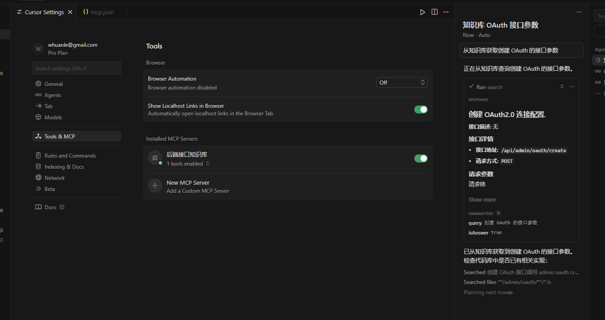
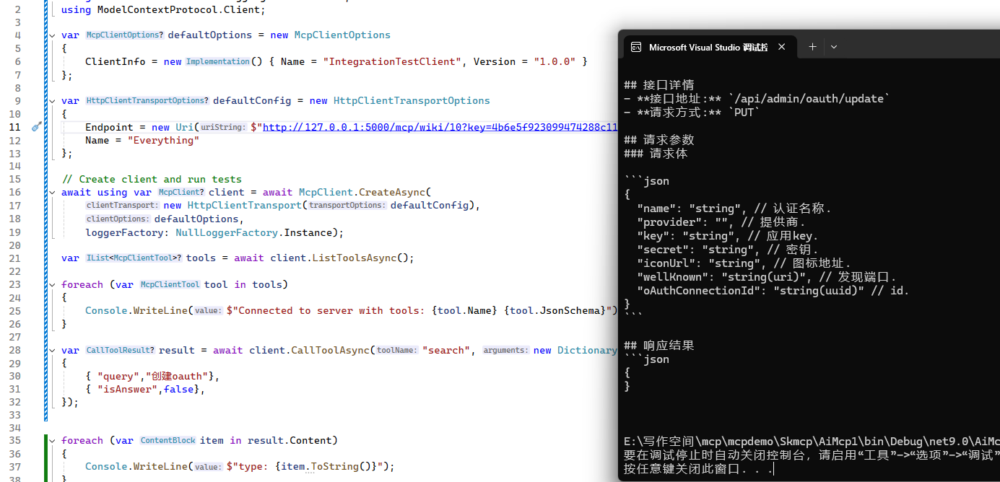

# MCP

MoAI 知识库支持开启 MCP 功能，每个知识库的 MCP 都是单独隔离的，个人知识库、团队知识库可以开启 MCP 功能，让你在日常开发任务和使用 AI 工具时，搭配知识库更加好得完成任务。

在知识库中开启 MCP 配置，保存好里面的 MCP 地址和密钥。

你可以在 cursor 里面导入。

在写代码时，会自动使用检索知识库，帮助你更加好地完成任务。

你也可以通过编程方式接入 MoAI 知识库。

